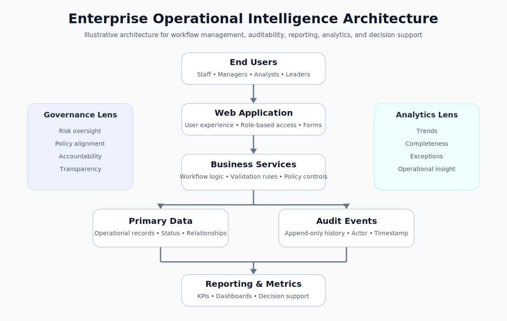

# Enterprise Operational Intelligence Architecture

This diagram illustrates a non-confidential enterprise architecture pattern for systems that combine workflow management, auditability, reporting, analytics, and decision support.

## What the Diagram Demonstrates

- Role-based user interaction
- Web application workflow
- Business service layer
- Separation of operational data and audit events
- Reporting and metrics layer
- Governance and analytics perspectives

## Design Intent

This is an illustrative architecture pattern. It does not represent any private product, customer system, employer system, or proprietary workflow.

